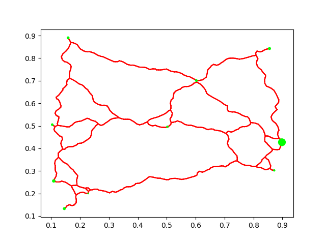
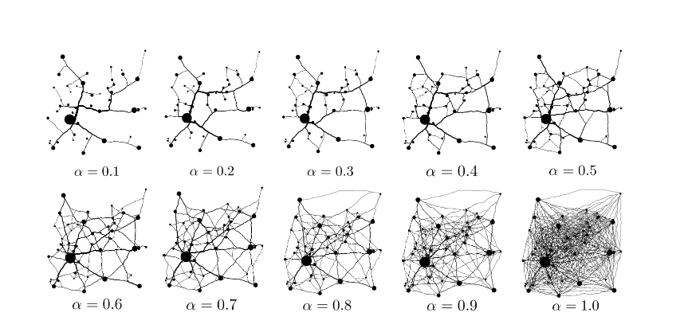

# AlphaModelRoadNetwork-cpp



An implementation of "A model for the generation of road networks" in C++

AKA the alpha model for procedural road network generation

[Original paper](https://arxiv.org/pdf/2001.08180)

# Building example
- Navigate to `example`
- Run `scons`
- You can run `scons debug=1` if you want debugging symbols and no compiler optimizations.

## Visualizing example output

- Navigate to `example/bin`
- Run `example`
- Run `python ../visualize.py`
- Enjoy the road.

# Usage

Create an `AlphaModelRoadGenerator` object, with your given cities.

```C++
    // Grab  some cities
    std::vector<RoadGraph::Vertex> cities;
    cities.push_back({.point = RoadGraph::Point {.x= 0.5, .y = 0.5}, .mass = 0.26});
    cities.push_back({.point = RoadGraph::Point {.x= 0.86, .y = 0.85}, .mass = 0.50});
    cities.push_back({.point = RoadGraph::Point {.x= 0.16, .y = 0.9}, .mass = 0.45});
    cities.push_back({.point = RoadGraph::Point {.x= 0.1, .y = 0.25}, .mass = 0.7});
    cities.push_back({.point = RoadGraph::Point {.x= 0.6, .y = 0.7}, .mass = 0.4});
    cities.push_back({.point = RoadGraph::Point {.x= 0.23, .y = 0.2}, .mass = 0.1});
    cities.push_back({.point = RoadGraph::Point {.x= 0.15, .y = 0.13}, .mass = 0.5});
    cities.push_back({.point = RoadGraph::Point {.x= 0.88, .y = 0.3}, .mass = 0.25});
    cities.push_back({.point = RoadGraph::Point {.x= 0.1, .y = 0.5}, .mass = 0.35});
    cities.push_back({.point = RoadGraph::Point {.x= 0.9, .y = 0.43}, .mass = 5.0});
    
    AlphaModelRoadGenerator road_generator = AlphaModelRoadGenerator({}, cities);
    
    // Run your generation
    AlphaModelRoadGenerator::RoadGenerationOutput output;
    road_generator.generate_roads({}, output);

    // Your roads will be in output.edges, with output.vertices being your vertex positions
```

# Settings

## Graph settings

- **bounds_\***: The bounds of the area to generate a road in
- **dummy_point_count**: How many dummy points to generate to use as discrete points to build roads through

## Generation settings



- **alpha** Alpha value, paper recommends 0.7 for human-like generation, the lower the more tree-like it is.
- **road_straightening_factor**: How much to straighten the roads after generation, gives a much more driveable result.

# Potential improvements
- The ability to return complete road paths with road weights
- The ability to sample a heightmap
- The ability to reject edges in more complex ways (such as rejecting edges that cross over city boundaries)